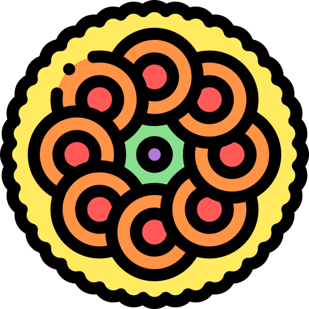

# Responsive-Portfolio

# HAPPY ONAM 

An responsive and efficent website for Mr. Maveli
 
created with the help of 

<code></code> 
<code></code> 
<code></code>
<code></code>
<code></code>
<code></code>
<code></code>
 

### Hosted at
github : https://vishnudas-bluefox.github.io/Responsive-Portfolio/
 
 
 
 
 

 
 

